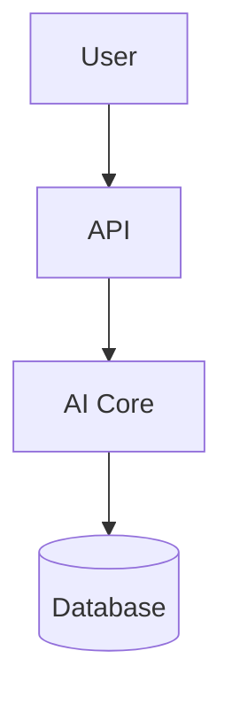

🐱💻 Creating "Programming Cats" Repository from Scratch

Let's create a new repository called "coding-kittens" (English version of "gatos programando") from scratch using Linux commands. Here's the complete step-by-step process:

1. First, Initialize the Repository Locally

```bash
#!/bin/bash

# Create directory structure
mkdir -p coding-kittens/{.github/workflows,src/{core,api,utils},tests/{unit,integration},docs,scripts/{deploy,setup}}

# Create basic files
touch coding-kittens/{.env.example,LICENSE,README.md,requirements.txt}
touch coding-kittens/docs/{ARCHITECTURE.md,API_REFERENCE.md}
touch coding-kittens/.github/ISSUE_TEMPLATE/bug_report.md

# Initialize git repo
cd coding-kittens
git init

# Create basic README content
cat << 'EOF' > README.md
# 🚀 Coding Kittens 


## ✨ Features
- Quantum purr-ogramming magic
- Scalable like a kitten's leap
- Faster than a meow

## 🛠️ Installation
```bash
pip install -e .
# or for npm magic:
npm run start --with-love
```

EOF

Create GitHub Actions workflow

cat << 'EOF' > .github/workflows/tests.yml name:Feline Style Tests on:[push, pull_request]

jobs: test: runs-on: ubuntu-latest steps: - uses: actions/checkout@v4 - name: Install dependencies run: | pip install -r requirements.txt npm install - name: Run tests run: pytest --cov=src --cov-report=xml - name: Upload coverage uses: codecov/codecov-action@v3 EOF

Create architecture documentation

cat << 'EOF' > docs/ARCHITECTURE.md

🧠 System Design



Data flow: Like a cat always landing on its feet. EOF

Create bug report template

cat << 'EOF' > .github/ISSUE_TEMPLATE/bug_report.md 🐞 Where it hurts Clear error description

📜 Steps to reproduce

1. git clone...
2. pip install...
3. 😿 Error!

🌞 Expected behavior There should be happiness here!

📸 Screenshots (optional) https://placekitten.com/400/300 EOF

Create .gitignore

cat << 'EOF' > .gitignore

Ignore non-purring things

*.log .env /dist/ pycache/ node_modules/ EOF

Create MIT License

cat << 'EOF' > LICENSE MIT License Copyright(c) 2025 MechBot-2x and Coding Kittens

Permission is hereby granted... EOF

Initial commit

git add . git commit-m "Initial commit: Coding Kittens project structure"

```

## 2. Create the Repository on GitHub

First, create a personal access token with repo permissions from GitHub settings, then:

```bash
# Set your GitHub credentials
GITHUB_USER="mechmind-dwv"
ORG_NAME="MechBot-2x"
REPO_NAME="coding-kittens"
TOKEN="your_personal_access_token_here"

# Create repository under organization
curl -X POST \
  -H "Authorization: token $TOKEN" \
  -H "Accept: application/vnd.github.v3+json" \
  https://api.github.com/orgs/$ORG_NAME/repos \
  -d '{"name":"'$REPO_NAME'","description":"Quantum programming with cats 🐱💻","private":false}'

# Add remote and push
git remote add origin https://github.com/$ORG_NAME/$REPO_NAME.git
git push -u origin main
```

3. Set Up the Frontend (Optional)

```bash
# Create React frontend with Vite
npm create vite@latest frontend -- --template react
cd frontend

# Install additional dependencies
npm install --save cosmic-visuals@latest tailwindcss framer-motion

# Initialize TailwindCSS
npx tailwindcss init -p

# Copy the package.json we created earlier
cat << 'EOF' > package.json
{
  "name": "coding-kittens-frontend",
  "private": true,
  "version": "1.0.0",
  "type": "module",
  "scripts": {
    "dev": "vite --host 0.0.0.0 --port 5173",
    "build": "vite build",
    "preview": "vite preview"
  },
  "dependencies": {
    "react": "^18.2.0",
    "react-dom": "^18.2.0",
    "cosmic-visuals": "^1.2.0",
    "framer-motion": "^10.12.4",
    "tailwindcss": "^3.3.0"
  },
  "devDependencies": {
    "@types/react": "^18.0.27",
    "@types/react-dom": "^18.0.10",
    "@vitejs/plugin-react": "^3.1.0",
    "autoprefixer": "^10.4.14",
    "postcss": "^8.4.21",
    "vite": "^4.1.0"
  }
}
EOF

# Commit and push frontend
git add .
git commit -m "Add React frontend with TailwindCSS"
git push origin main
```

4. Final Repository Structure

Your repository will have this structure:

```
coding-kittens/
├── .github/
│   ├── workflows/
│   │   └── tests.yml
│   └── ISSUE_TEMPLATE/
│       └── bug_report.md
├── frontend/ (optional)
│   ├── public/
│   ├── src/
│   ├── index.html
│   ├── package.json
│   └── vite.config.js
├── src/
│   ├── core/
│   ├── api/
│   └── utils/
├── tests/
│   ├── unit/
│   └── integration/
├── docs/
│   ├── ARCHITECTURE.md
│   └── API_REFERENCE.md
├── scripts/
│   ├── deploy/
│   └── setup/
├── .env.example
├── .gitignore
├── LICENSE
├── README.md
└── requirements.txt
```

5. Additional Automation (Optional)

Create a setup script:

```bash
cat << 'EOF' > scripts/setup/project_init.sh
#!/bin/bash

# Install Python dependencies
python -m venv .venv
source .venv/bin/activate
pip install -r requirements.txt

# Install Node.js dependencies
cd frontend
npm install
cd ..

echo -e "\n\e[32mSetup complete! 🎉\e[0m"
echo "Activate virtualenv: source .venv/bin/activate"
echo "Start frontend: cd frontend && npm run dev"
EOF

chmod +x scripts/setup/project_init.sh
```

Now you have a complete "Coding Kittens" repository under your MechBot-2x organization, ready for development! The repository includes:

1. Professional project structure
2. GitHub Actions CI/CD
3. Documentation templates
4. Frontend setup (optional)
5. All the cat-themed goodness from the original

Would you like me to add any specific additional features or make adjustments to this setup? 😊